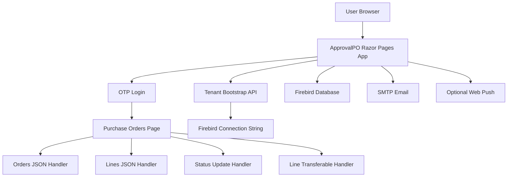
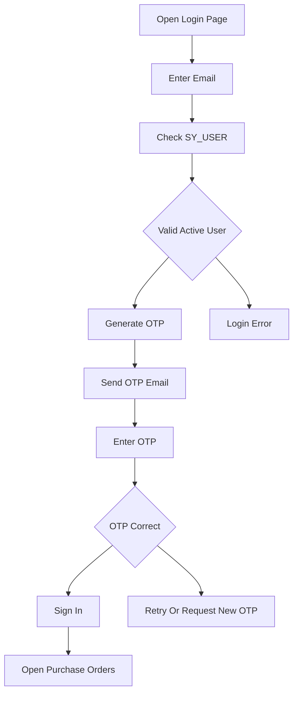
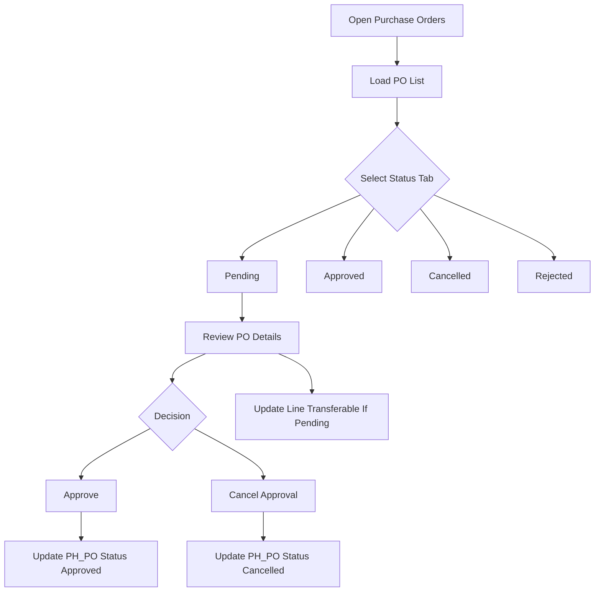
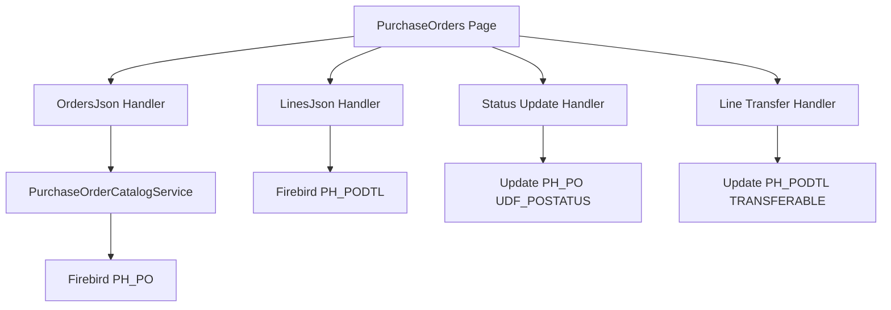
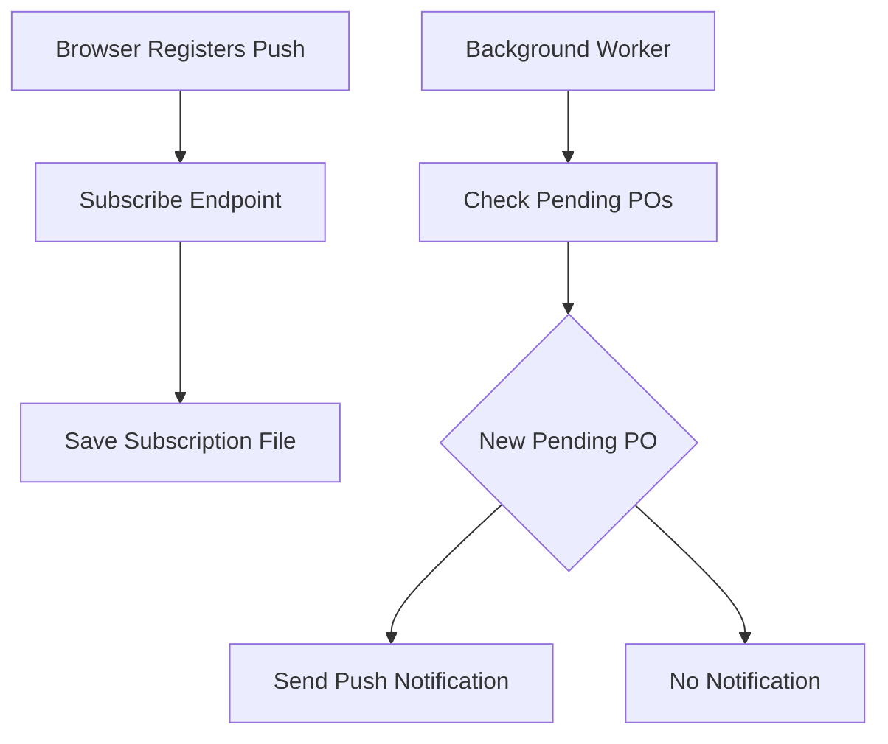

# ApprovalPO Enterprise Documentation

# Purchase Order Approval System

Document type: Enterprise system documentation

Project path: C:\Users\sqlsupport\ApprovalPO

Application type: ASP.NET Core 8 Razor Pages web application

Primary users: Purchase order approvers, office staff, branch staff, management, and support team

Primary purpose: Review purchase orders, approve or cancel purchase order approval status, manage purchase order line transferability, receive pending purchase order notifications, and support tenant based Firebird database access.

# 1. Introduction

## 1.1 Purpose

ApprovalPO is a web based purchase order approval system. It allows authenticated users to review purchase orders from the company Firebird database and update approval status from a browser.

The system is designed to support the purchase approval process by giving staff one central screen to view pending, approved, cancelled, or rejected purchase orders. Users can open a purchase order, review the header and line details, approve the purchase order, cancel approval, and update line transferability where allowed.

## 1.2 Business Objective

The main business objective is to make purchase order approval faster, easier to review, and more traceable.

The system helps the company:

1. View purchase orders in a clear approval screen.

2. Identify pending purchase orders quickly.

3. Approve purchase orders from the web interface.

4. Cancel approval where needed.

5. Review purchase order line items before approval.

6. Control line transferability for pending purchase orders.

7. Notify users when new pending purchase orders are available.

8. Use tenant based database configuration for deployment.

## 1.3 Documentation Scope

This document explains the ApprovalPO project from an enterprise and operational support viewpoint.

It covers:

1. System overview.

2. User access and authentication.

3. Purchase order approval workflow.

4. Main screens and routes.

5. Data model and Firebird tables.

6. Web Push notification behavior.

7. Configuration and deployment.

8. Security and operational notes.

9. Support checklist.

10. Future enhancement recommendations.

# 2. System Overview

## 2.1 High Level Summary

ApprovalPO is built with ASP.NET Core 8 Razor Pages. It is not a traditional MVC controller based application. Most web logic is implemented through Razor Page models and page handlers.

The application reads purchase order data from a Firebird database. The main purchase order header table is PH_PO and the main purchase order line table is PH_PODTL. User login validation uses the SY_USER table.

The system can run as a Windows Service and is designed for internal company use, often connected to a tenant specific Firebird database resolved from an external tenant configuration service.

## 2.2 Main Features

| Feature | Description |
|---|---|
| OTP Login | Users log in with email and one time password |
| SY_USER Validation | Login email is checked against Firebird SY_USER |
| Purchase Order List | Shows purchase orders with status tabs |
| Purchase Order Review | Allows user to view purchase order line details |
| Approve | Updates purchase order status to Approved |
| Cancel Approval | Updates purchase order status to Cancelled |
| Line Transferability | Allows line level transferable flag update while PO is pending |
| Bulk Approve | Allows multiple pending purchase orders to be approved |
| Web Push | Optional browser notification for new pending purchase orders |
| Tenant Bootstrap | Resolves Firebird database settings from tenant API |

## 2.3 High Level Architecture

## 2.4 Technology Summary

| Area | Technology |
|---|---|
| Framework | ASP.NET Core 8 |
| UI Pattern | Razor Pages |
| Main Language | C# |
| Main Database | Firebird |
| Firebird Driver | FirebirdSql.Data.FirebirdClient |
| Email | MailKit SMTP |
| Cloud Secret Support | AWS Secrets Manager |
| Tenant Config | HTTP tenant bootstrap API |
| Notifications | WebPush |
| Environment Loading | DotNetEnv |
| Hosting | Kestrel and Windows Service |

# 3. User Access And Authentication

## 3.1 Login Model

Users log in with an email address. The system checks the email against Firebird SY_USER. If the email exists and is active, the system generates a one time password and sends it to the user email.

After the OTP is verified, the system creates an authentication cookie and allows the user to access the purchase order page.

## 3.2 Login Flow

## 3.3 User Access Model

The current code uses authentication as the main access control. Users who can log in can access the purchase order approval screen.

There is no detailed ASP.NET role based approval policy in the current implementation. This means enterprise deployments should confirm whether all authenticated SY_USER email users are allowed to approve or cancel purchase orders.

## 3.4 Session Behavior

The application uses cookie authentication. Session length is configured under the Approval settings. Cookie settings include HttpOnly and SameSite behavior.

The session supports sliding expiration, meaning active users can remain signed in during the configured session window.

## 3.5 OTP Controls

The OTP flow includes controls such as expiry, send limits, verification limits, and optional IP throttling depending on configuration.

For production, OTP debug or expose settings should be disabled unless the system is used only in a controlled internal environment.

# 4. Purchase Order Approval Workflow

## 4.1 Main Approval Screen

The main working screen is /PurchaseOrders.

This page displays purchase orders and lets the user switch between status tabs such as Pending, Approved, Cancelled, and Rejected.

The list is loaded through a JSON handler and displayed using JavaScript in the browser.

## 4.2 Purchase Order Review

Users can review a purchase order before approving it.

The review screen or modal shows purchase order header information and purchase order line details. Line details come from PH_PODTL and are linked to the purchase order by DOCKEY.

## 4.3 Approval Action

When a pending purchase order is approved, the system updates PH_PO.UDF_POSTATUS to APPROVED.

The UI can also support bulk approve for selected pending purchase orders.

## 4.4 Cancel Approval Or Reject Behavior

The UI reject or cancel approval behavior writes a cancelled style status in the current workflow.

The database can contain REJECTED status values, and the UI may display a Rejected tab, but the main reject or cancel action currently persists CANCELLED in the approval status field.

This should be clearly understood by management and reporting users.

## 4.5 Line Transferable Flag

Purchase order lines include a transferable flag. Users can update this flag while the purchase order header is pending.

The server protects this update by checking that the header is still pending before allowing line transferability to be updated.

## 4.6 Approval Workflow Diagram

## 4.7 Status Summary

| Status | Meaning |
|---|---|
| Pending | Purchase order is waiting for review or approval |
| Approved | Purchase order has been approved |
| Cancelled | Approval was cancelled or purchase order was cancelled in workflow |
| Rejected | Rejected status exists in database and may appear in the UI, but primary reject flow writes Cancelled |

# 5. Main Pages, Routes, And Handlers

## 5.1 Razor Pages

| Page | Purpose |
|---|---|
| / | Redirects user to Login or PurchaseOrders |
| /Login | Login page and OTP handling |
| /Logout | Signs the user out |
| /PurchaseOrders | Main purchase order approval screen |
| /Error | Error display page |

## 5.2 Purchase Order Handlers

The PurchaseOrders Razor Page exposes handlers used by the browser.

| Handler | Purpose |
|---|---|
| OrdersJson | Returns purchase order list |
| LinesJson | Returns purchase order line details for a selected DOCKEY |
| PendingNotifySnapshot | Returns pending purchase order snapshot for notification polling |
| SetTransferable | Updates header approval list status |
| SetLineTransferable | Updates line transferable value |

## 5.3 Web Push Endpoints

| Endpoint | Access | Purpose |
|---|---|---|
| GET /api/web-push/vapid-public-key | Anonymous | Returns public VAPID key information |
| POST /api/web-push/subscribe | Authenticated | Saves browser push subscription |
| POST /api/web-push/unsubscribe | Authenticated | Removes browser push subscription |

## 5.4 Client Files

| File | Purpose |
|---|---|
| wwwroot/js/po-list.js | Main purchase order list behavior |
| wwwroot/js/po-notify.js | Pending purchase order notification behavior |
| wwwroot/js/push-register.js | Browser push subscription logic |
| wwwroot/css/po.css | Purchase order page styling |
| wwwroot/css/login.css | Login page styling |
| wwwroot/sw.js | Service worker for push notification support |

# 6. Data And Database Overview

## 6.1 Main Firebird Tables

| Table | Purpose |
|---|---|
| PH_PO | Purchase order header table |
| PH_PODTL | Purchase order line detail table |
| SY_USER | User email validation and display name |

## 6.2 Purchase Order Header Data

The purchase order list is based on PH_PO.

Common fields include:

1. DOCKEY for document identity.

2. DOCNO for purchase order number.

3. Vendor related information.

4. DOCAMT for amount.

5. DESCRIPTION for remarks or description.

6. DOCDATE for order date.

7. UDF_POSTATUS for approval status.

## 6.3 Purchase Order Line Data

Purchase order lines are based on PH_PODTL.

Common fields include:

1. DOCKEY to link to the purchase order header.

2. SEQ or line number.

3. Item code.

4. Quantity values.

5. Unit price.

6. Line amount.

7. TRANSFERABLE flag.

## 6.4 Data Access Pattern

The system uses direct Firebird SQL through the Firebird client library.

Default SQL queries are provided by the application, but some SQL can be overridden through configuration if a company has nonstandard database structure.

## 6.5 Data Flow Diagram

# 7. Tenant Bootstrap, Email, And Web Push

## 7.1 Tenant Bootstrap

The system can resolve tenant database configuration from an external tenant bootstrap API.

The tenant code can come from TENANT_CODE or TenantBootstrap configuration. The resolver calls the tenant API and builds a Firebird connection string using database information returned by the tenant record.

## 7.2 Tenant Data Used

Tenant bootstrap may provide:

1. Firebird host.

2. Firebird database path.

3. Firebird port.

4. Firebird charset and dialect.

5. Tenant email or SMTP override settings.

6. Secret references for SMTP credentials.

## 7.3 Email And OTP

OTP email is sent through SMTP using MailKit.

The email settings can come from appsettings, tenant email override values, or AWS Secrets Manager references depending on configuration.

If email is not working, staff may not be able to log in unless a special fallback setting is enabled. Production systems should avoid exposing OTP values in responses.

## 7.4 Web Push Notifications

Web Push is optional.

When enabled, the system can notify subscribed users when new pending purchase orders appear. Subscription data is stored in local JSON files under the application data folder.

## 7.5 Web Push Flow

# 8. Configuration And Deployment

## 8.1 Configuration Sources

| Source | Purpose |
|---|---|
| appsettings.json | Main application configuration |
| appsettings.Development.json | Development overrides |
| appsettings.Production.json | Production overrides |
| .env | Tenant and environment values |
| Environment variables | Deployment specific overrides |
| AWS Secrets Manager | SMTP secret values when configured |

## 8.2 Important Configuration Areas

| Area | Purpose |
|---|---|
| TenantBootstrap | Tenant API, tenant code, Firebird user, Firebird password |
| Approval | Session hours, OTP settings, SQL overrides, notification polling |
| Smtp | OTP email sending configuration |
| WebPush | VAPID keys and push notification behavior |
| AWS | AWS region for Secrets Manager |
| AllowedHosts | Host filtering for production |

## 8.3 Hosting Model

ApprovalPO is designed to run on Windows and can run as a Windows Service.

The application uses Kestrel endpoints and can be placed behind a reverse proxy if required.

Production endpoint ports and TLS behavior are controlled by configuration. Development launch profiles may use different local ports.

## 8.4 Production Deployment Checklist

Before production use, confirm:

1. ASP.NET Core 8 runtime is installed if using framework dependent deployment.

2. Tenant code is configured.

3. Tenant API returns the correct Firebird database settings.

4. Firebird connection works.

5. SY_USER email validation works.

6. SMTP OTP email works.

7. PurchaseOrders page loads purchase order records.

8. Approve and cancel actions update PH_PO correctly.

9. Line transferable updates work for pending purchase orders.

10. Web Push settings are configured only if notifications are required.

# 9. Security And Operational Notes

## 9.1 Security Considerations

ApprovalPO handles purchase order approval status, staff login, database credentials, SMTP credentials, and optional push notification subscriptions.

Important security items:

1. Protect Firebird credentials.

2. Protect SMTP credentials.

3. Use secure deployment secrets instead of committing secrets in appsettings.

4. Disable OTP exposure settings in production unless the environment is strictly controlled.

5. Review whether all authenticated users should be allowed to approve purchase orders.

6. Configure trusted reverse proxy headers carefully.

7. Restrict AllowedHosts for internet facing deployments.

8. Protect local Data folder containing Web Push subscription files.

## 9.2 Authorization Note

The current implementation mainly checks whether a user is authenticated through SY_USER email validation.

It does not implement detailed role based approval rules in the reviewed code. If the company requires segregation of duties, role based approval should be added or confirmed through external process.

## 9.3 Operational State

Some application state is stored outside the database:

| State | Location |
|---|---|
| OTP values | In memory |
| Login throttle state | In memory |
| Tenant connection cache | In memory |
| Web Push subscriptions | Local JSON file |
| Web Push pending cursor | Local JSON file |

In memory state is reset when the application restarts.

## 9.4 Common Support Issues

| Issue | What To Check |
|---|---|
| User cannot log in | Check SY_USER email and active status |
| OTP not received | Check SMTP settings and spam folder |
| Purchase orders not loading | Check Firebird connection and PH_PO query |
| Lines not loading | Check PH_PODTL data for the selected DOCKEY |
| Approve does not work | Check UDF_POSTATUS update and antiforgery token |
| Line transferable cannot update | Check header is still pending |
| Push notification not working | Check WebPush enabled flag, VAPID keys, and Data folder write access |
| Tenant resolution fails | Check TENANT_CODE, tenant API URL, API key, and AWS/network access |

# 10. Maintenance And Future Enhancements

## 10.1 Regular Maintenance

Regular maintenance should include:

1. Checking Firebird connectivity.

2. Checking tenant bootstrap configuration.

3. Checking SMTP OTP delivery.

4. Reviewing purchase order approval results.

5. Checking database backup process.

6. Reviewing appsettings for exposed secrets.

7. Checking Web Push data files if notifications are enabled.

8. Confirming Windows Service restart behavior.

## 10.2 Recommended Future Enhancements

| Enhancement | Benefit |
|---|---|
| Role based approval rules | Ensures only authorized approvers can approve purchase orders |
| Approval audit log screen | Makes approval history easier to review |
| Pagination and search | Improves performance for large purchase order lists |
| Better reject reason handling | Distinguishes rejected from cancelled more clearly |
| Centralized notification settings | Easier management of push notification behavior |
| External OTP store | Supports multi server deployment |
| Secret cleanup process | Reduces risk of credentials in source files |
| Automated integration tests | Reduces risk during future updates |

## 10.3 Final Summary

ApprovalPO is a focused purchase order approval system built for internal company operations.

Its most important business functions are purchase order review, approval status update, line transferability control, OTP based login, tenant database resolution, and optional push notification for pending purchase orders.

The most important maintenance areas are Firebird connectivity, staff email accuracy, OTP email delivery, approval authorization policy, database backup, and safe handling of configuration secrets.

## 10.4 Document Control

| Item | Value |
|---|---|
| Document Owner | Company support and development team |
| Document Level | Enterprise system documentation |
| System | ApprovalPO |
| Project Path | C:\Users\sqlsupport\ApprovalPO |
| Status | Ready for internal review |
